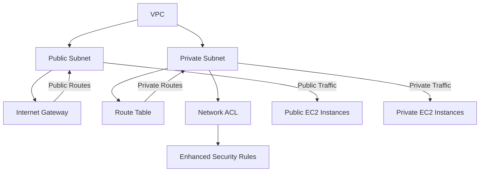
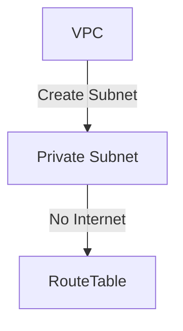
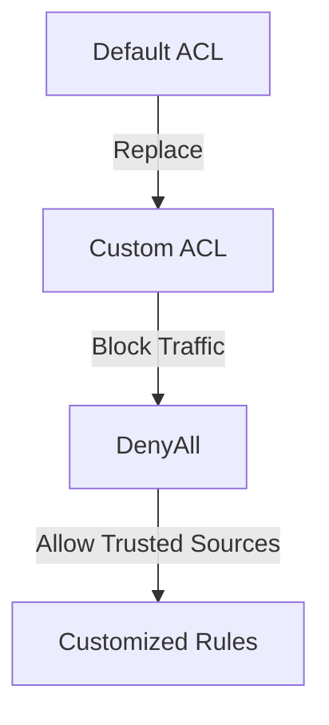
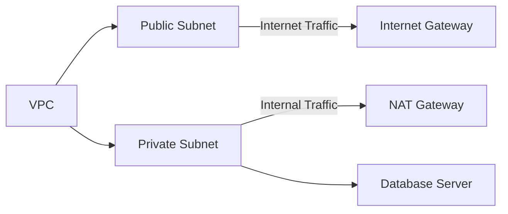

# Creating-a-Private-Subnet

# 🌟 **Creating a Secure Private Subnet in AWS** 🌟  

Welcome to the **Creating a Secure Private Subnet in AWS** project! This project demonstrates how to use **Amazon Virtual Private Cloud (VPC)** to create secure, isolated network environments for AWS resources. Learn how to configure subnets, route tables, and network ACLs for optimized data flow and enhanced security.  

---

## 🚀 **Today's Highlights**  

### 1️⃣ **What is Amazon VPC?**  
Amazon VPC enables users to create a logically isolated network in the AWS cloud. It provides control over:  
- IP addressing  
- Subnets (Public and Private)  
- Route tables  
- Security groups  
- Network ACLs  

### 2️⃣ **How I Used Amazon VPC**  
- Designed secure, isolated network environments.  
- Configured **private and public subnets**.  
- Managed **route tables** and **security groups** to control access.  
- Ensured optimal data flow between AWS instances and external services.  

### 3️⃣ **Key Learnings**  
🔍 **Private vs Public Subnets**  
- **Public Subnets**: Direct internet access via an Internet Gateway.  
- **Private Subnets**: No direct internet access, ideal for sensitive resources.  

🔐 **Enhanced Security**  
Private subnets are ideal for databases or application servers that should remain isolated from external networks, ensuring protection from unauthorized access.  

---

## 🗺️ **Project Architecture**  

## Key Components
Public Subnet: For resources requiring direct internet access (e.g., web servers).
Private Subnet: For internal resources like databases and application servers.
Internet Gateway: Routes internet traffic for public subnets.
Route Table: Ensures private subnets have no routes to the internet.
Network ACL: Restricts inbound and outbound traffic for private subnets.
## 💻 Steps to Secure a Private Subnet
### 1️⃣ Create and Isolate the Private Subnet
Configure the private subnet within the VPC.
Ensure it is not associated with an Internet Gateway.

### 2️⃣ Setup a Dedicated Route Table
Remove default routes to the Internet Gateway.
Add routes for internal communication within the VPC.
### 3️⃣ Implement a Custom Network ACL
Deny all traffic by default.
Gradually allow inbound and outbound traffic for specific trusted sources.

## 🎯 Results
Enhanced Security: The private subnet is fully isolated, allowing access only from trusted sources.
Custom Network ACL: Fine-tuned traffic control ensures no unauthorized access.
Dedicated Route Table: Prevents accidental exposure to the internet.
## 📊 Quick Comparison
Feature	Public Subnet	Private Subnet
Internet Access	Yes, via Internet Gateway	No, fully isolated
Use Case	Web Servers, Load Balancers	Databases, Application Servers
Security Level	Moderate	High
## 🎨 Visualizing the Private Subnet Workflow

## 🔍 What Surprised Me
One unexpected challenge was managing overlapping IP addresses across multiple VPCs. This required careful planning to avoid conflicts and ensure seamless connectivity.

## ⏱️ Time Taken
This project took approximately 1 hour to complete, including:

Planning the architecture.
Configuring the private subnet, route tables, and ACLs.
Testing and troubleshooting connectivity issues.
## 🌟 Key Takeaways
Private Subnets are crucial for isolating sensitive workloads.
Custom Route Tables and Network ACLs significantly enhance security.
Thoughtful planning prevents network conflicts in multi-VPC setups.
## 🚀 Next Steps
🔮 Automate subnet creation with AWS CloudFormation.
🔮 Integrate the private subnet with a highly available database cluster.
🔮 Implement monitoring tools for real-time traffic insights.

## 📧 Contact Me
For questions or feedback, reach out:
📨 Email: briannkimemia@gmail.com
🌐 Portfolio: [Brian Kimemia](https://briankimemia.vercel.app/projects)

Thank you for exploring this project! Let’s continue to build secure, scalable networks together! 🚀
